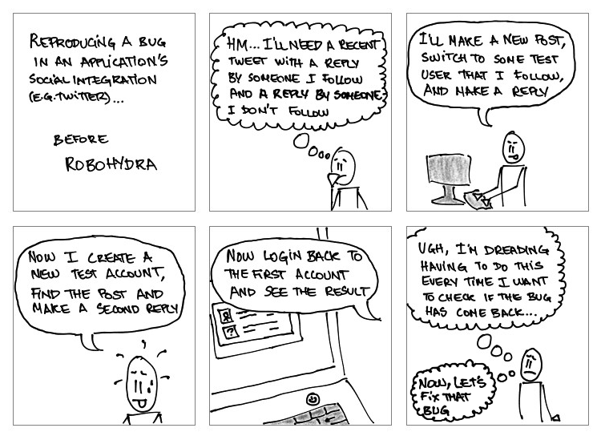
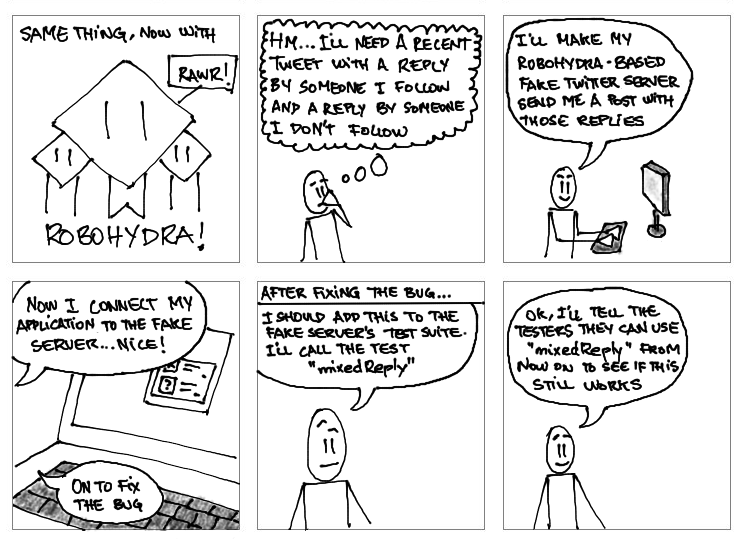

RoboHydra usecases
==================

RoboHydra can be used in many different ways. It's closer to a "swiss
army knife of client testing" than a very specific testing tool with a
single purpose. Thus, it can be at first hard to tell whether or not
RoboHydra can help you do what you want. The following is a list of
usecases and examples of what RoboHydra can do:
[testsuites](#testsuites), [exploratory
testing](#exploratory_testing), [help test race
conditions](#testing_race_conditions), [help your front-end
developers](#make_your_frontend_developers_lives_easier), and
[off-line testing and prototyping](#offline_testingprototyping).

Testsuites
----------

Often, testing the client side of a client-server project is
cumbersome and time-consuming:

However, what if you could easily, instantly get whatever responses
you needed from your server, plus you could save those special
responses so that you can recall them later? With RoboHydra, you can:

It's easy to configure a RoboHydra-based server to mimick any server
behaviour needed to test your clients. Examples of this might be:

* Testing how the client behaves when it receives a certain
combination of valid (but possibly uncommon, cumbersome or even
impossible to reproduce) data.

* Being able to easily reproduce race conditions.

* Checking how the client behaves when the server returns Internal
Server Error or invalid data.

* Simulating server connection latency when connecting to a real
server.

So, let's say you build a client of the [Opera Link
API](http://dev.opera.com/articles/view/introducing-the-opera-link-api/)
and decide to build a test suite for it. The first step would be to
identify what test cases are useful or interesting to test. In this
case, let's assume that what you want is to simulate a user data store
with one Speed Dial and two bookmarks, one of the bookmarks having the
same URL as the Speed Dial. In that case, these two RoboHydra heads
would do the job nicely:

    tests: {
        duplicateUrlInSpeeddialAndBookmark: {
            heads: [
                new RoboHydraHeadStatic({
                    path: '/rest/speeddial/children',
                    // You can pass a Javascript object directly in "content":
                    // it will be converted to JSON
                    content: [
                        {
                            "item_type": "speeddial",
                            "id": "1",
                            "properties": {
                                "reload_interval": "2147483646",
                                "title": "Opera Portal beta",
                                "uri": "http://redir.opera.com/speeddials/portal/",
                                "reload_only_if_expired": "0",
                                "reload_enabled": "0"
                            }
                        }
                    ]
                }),

                new RoboHydraHeadStatic({
                    path: '/rest/bookmark/children',
                    content: [
                        {
                            "item_type": "bookmark",
                            "id": "319A38DB4581426DA48CAB58C2528FD4",
                            "properties": {
                                "created": "2010-08-18T12:59:13Z",
                                "uri": "http://opera.com",
                                "title": "My first API bookmark"
                            }
                        },
                        {
                            "item_type": "bookmark",
                            "id": "419A38DB4581426DA48CAB58C2528FD5",
                            "properties": {
                                "created": "2010-08-18T12:59:13Z",
                                "title": "My first API bookmark",
                                "uri": "http://redir.opera.com/speeddials/portal/"
                            }
                        }
                    ]
                })
            ]
        },

        // ... Other tests ...
    }

Once you have your test defined, you can go to the [test admin
interface](http://localhost:3000/robohydra-admin/tests) and activate
each test before starting it. Note that if your client was web-based
and you were automating your tests with something like Selenium, you
could easily change the current test by sending a POST request to a
URL like
[http://localhost:3000/robohydra-admin/tests/operalink-client-testsuite/duplicateUrlInSpeeddialAndBookmark](http://localhost:3000/robohydra-admin/tests/operalink-client-testsuite/duplicateUrlInSpeeddialAndBookmark)
before every test (where "operalink-client-testsuite" in that URL
would be the name of the plugin containing the test).

Exploratory testing
-------------------

Maybe you're not interested in building a "formal" test suite for your
client, but would like to be able to reproduce certain situations
easily. For this example, imagine you're implementing a client for
some API that specifies that, in order to allow for future extensions,
all clients must ignore any attributes they don't understand. As a
tester, it would be great to be able to test that easily and reliably
(something the server will never return).

One possibility would be to use RoboHydra as a proxy to your normal
development server, and then create heads dynamically using the [admin
interface](http://localhost:3000/robohydra-admin) to get specific test
responses for certain paths (say, temporarily override path
`/api/widgets/1` to show some special testing data instead of whatever
your development server replies with).

Testing race conditions
-----------------------

Even if your "testing" doesn't need any support, RoboHydra might come
in handy to reliably reproduce hard-to-track bugs like race
conditions.  For example, let's say you are building an application
that uses two different servers: one for authentication and another
one to retrieve data from. Usually the authentication server replies
before the client can manage to send the data retrieval request, but
if it doesn't, maybe the client will send the request with an empty or
invalid user name.

RoboHydra allows you to set up this "race condition" in a reliable
way, making the authentication request take a couple of seconds to
respond, or maybe respond with an internal server error or not respond
at all. This usage of RoboHydra might make it trivial to debug and fix
errors that otherwise could take hours, if not days. Not to mention
that once fixed, it would be much easier to verify the fix.

This simple head waits one second before serving requests for the
`/authentication` URL path:

                   new RoboHydraHead({
                       path: '/authentication',
                       handler: function(req, res, next) {
                           setTimeout(function() {
                               next(req, res);
                           }, 1000);
                       }
                   }),

                   // ... head that actually serves the
                   // "/authentication" path (eg. a proxying head) ...

Make your front-end developers' lives easier
--------------------------------------------

Imagine you have a team split into front-end developers and back-end
developers. If it's a hassle for your front-end developers to install
their own development back-end (eg. different platforms, many
dependencies, front-end developers not familiar with the language or
environment you're using for the back-end, etc.), RoboHydra might be
helpful.

One possiblity is to prepare a very simple RoboHydra plugin that
serves the front-end files from the local disk, while all other paths
are proxied. That would allow you to have a single development
backend, but many front-end developers working on their own version of
the front-end files independently of the rest. These two heads might
do the trick:

                   new RoboHydraHeadStatic({
                       mountPath: '/js',
                       documentRoot: 'src/js'
                   }),

                   new RoboHydraHeadProxy({
                       mountPath: '/',
                       proxyTo: 'http://dev.myapp.example.com'
                   }),

Offline testing/prototyping
---------------------------

In other situations, you might not have access to the server at
all. Maybe you don't have internet access, or you are outside of the
intranet and don't have access to a VPN, etc. In those cases,
RoboHydra can be used to save the traffic sent by the server, and then
replay it whenever you don't have access to the internet.

RoboHydra comes with a simple _replayer_ plugin for this (see the
[screencast](http://www.youtube.com/watch?v=tuEOSoi0RFM)).
